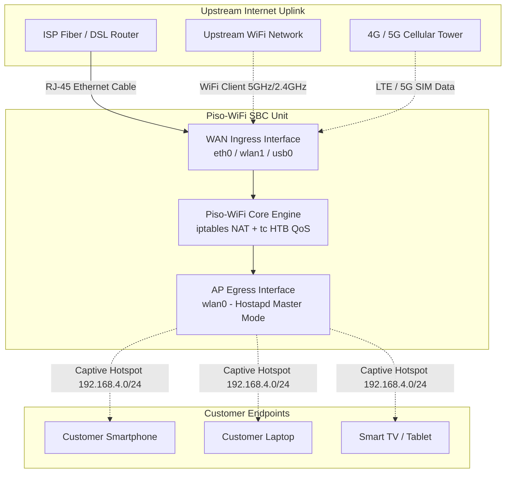
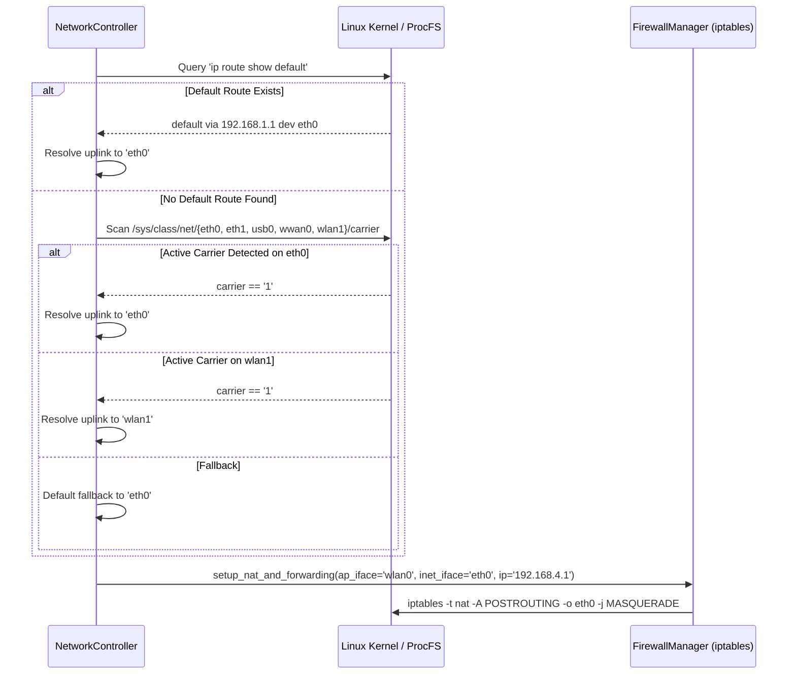

# Piso-WiFi Operator & Administrator User Manual

Welcome to the **Piso-WiFi Operator & Administrator User Manual**. This document provides an exhaustive, production-grade guide to designing, assembling, configuring, operating, and troubleshooting a commercial Piso-WiFi vending machine or community hotspot network powered by the Piso-WiFi software platform.

---

## Table of Contents

1. [Section 1: System Architecture & Hardware Topologies](#section-1-system-architecture--hardware-topologies)
   - [Topology A: Ethernet WAN to Wireless AP (LAN-to-WLAN) — Recommended Production Setup](#topology-a-ethernet-wan-to-wireless-ap-lan-to-wlan--recommended-production-setup)
   - [Topology B: Dual Wireless (WLAN-to-WLAN)](#topology-b-dual-wireless-wlan-to-wlan)
   - [Topology C: 4G/5G USB Modem WAN (LTE-to-WLAN)](#topology-c-4g5g-usb-modem-wan-lte-to-wlan)
2. [Section 2: Hardware Setup & Wiring Guide](#section-2-hardware-setup--wiring-guide)
   - [Supported Single-Board Computers (SBCs)](#supported-single-board-computers-sbcs)
   - [Recommended USB WiFi Adapters & Chipsets](#recommended-usb-wifi-adapters--chipsets)
   - [Power Supply & Power Distribution Architecture](#power-supply--power-distribution-architecture)
   - [Coin Slot Hardware Wiring (Allan 1239 Multi-Coin Selector)](#coin-slot-hardware-wiring-allan-1239-multi-coin-selector)
3. [Section 3: Configuration & Deployment](#section-3-configuration--deployment)
   - [Environment Variables Reference (`.env`)](#environment-variables-reference-env)
   - [How Automatic Uplink Detection (`INTERNET_INTERFACE=auto`) Works](#how-automatic-uplink-detection-internet_interfaceauto-works)
   - [Production Deployment: Native Linux Systemd](#production-deployment-native-linux-systemd)
   - [Containerized Deployment: Docker Compose](#containerized-deployment-docker-compose)
4. [Section 4: Operating Guide & Web Dashboard](#section-4-operating-guide--web-dashboard)
   - [Accessing the Dashboard](#accessing-the-dashboard)
   - [Customer Captive Portal Experience](#customer-captive-portal-experience)
   - [Adding Customer Time (Pesos-to-Minutes Conversion)](#adding-customer-time-pesos-to-minutes-conversion)
   - [Deducting Customer Time Manually](#deducting-customer-time-manually)
   - [Managing Bandwidth Plans & Quality of Service (QoS)](#managing-bandwidth-plans--quality-of-service-qos)
   - [Admin Authentication & Plan Approval](#admin-authentication--plan-approval)
5. [Section 5: Maintenance, Diagnostics & Troubleshooting](#section-5-maintenance-diagnostics--troubleshooting)
   - [Inspecting WAN Uplink Status & Connected Clients](#inspecting-wan-uplink-status--connected-clients)
   - [The `/debug/connections` Diagnostic Endpoint](#the-debugconnections-diagnostic-endpoint)
   - [Verifying Core Subsystems (iptables, hostapd, dnsmasq, tc)](#verifying-core-subsystems-iptables-hostapd-dnsmasq-tc)
   - [Common Issues Runbook](#common-issues-runbook)

---

## Section 1: System Architecture & Hardware Topologies

The Piso-WiFi system functions as a software-defined edge router, captive portal, and billing controller. It bridges an upstream **Wide Area Network (WAN)** uplink to a downstream **Wireless Local Area Network (WLAN)** captive access point.

Depending on the installation venue, power availability, and network infrastructure, three primary hardware network topologies are supported:



---

### Topology A: Ethernet WAN to Wireless AP (LAN-to-WLAN) — Recommended Production Setup

> [!IMPORTANT]
> **Topology A is the official production standard** for high-volume commercial Piso-WiFi deployments. It delivers maximum stability, lowest packet jitter, and zero wireless interference on the internet uplink.

#### Architectural Breakdown

```
[ISP Fiber / DSL Modem]
         |
         | RJ-45 Cat5e/Cat6 Patch Cable (100 Mbps / 1 Gbps)
         v
[eth0: WAN Ingress] -> [Piso-WiFi SBC (Orange Pi / Raspberry Pi)]
                                  |
                                  | Kernel Packet Forwarding + NAT + tc Traffic Shaper
                                  v
                       [wlan0: AP Hotspot] (2.4 GHz 802.11b/g/n)
                                  |
                        ))) WiFi Broadcast (((
                                  |
                   [Connected Customer Devices]
                  (192.168.4.2 - 192.168.4.200)
```

1. **Physical Cabling**: Connect a standard Cat5e or Cat6 RJ-45 Ethernet patch cable from any LAN port of your ISP modem/router (PLDT, Globe, Converge, DITO) directly into the onboard Ethernet jack (`eth0`) of the Orange Pi or Raspberry Pi.
2. **WAN Subnet Auto-Negotiation**: The SBC acts as a standard DHCP client on `eth0`, acquiring an IP address from the ISP modem (typically in the `192.168.1.0/24` or `192.168.254.0/24` subnet).
3. **LAN/WLAN Subnet Isolation**: The Piso-WiFi access point daemon (`hostapd`) and DHCP server (`dnsmasq`) broadcast an isolated local subnet on `wlan0`:
   - Gateway IP: `192.168.4.1`
   - Netmask: `255.255.255.0`
   - Client Pool: `192.168.4.2` – `192.168.4.20` (expandable up to `192.168.4.254`)
4. **Packet Forwarding Engine**: The Linux kernel forwards authorized packets between `wlan0` and `eth0` via `iptables` IP masquerading (`MASQUERADE`).
5. **Key Advantages**:
   - **Zero Wireless Channel Contention**: Uplink bandwidth is transmitted over copper, leaving 100% of the wireless spectrum available for client communication.
   - **Full ISP Line Speed**: Handles 50 Mbps, 100 Mbps, or higher fiber tiers without USB bus bottlenecks.
   - **Low Latency & High Stability**: Essential for competitive mobile gaming (e.g., *Mobile Legends*, *Free Fire*) and crisp video calls.
   - **Carrier Link Detection**: The software automatically monitors `/sys/class/net/eth0/carrier`. If the cable is unplugged or the ISP modem power cycles, the system immediately flags the link status on the admin dashboard.

---

### Topology B: Dual Wireless (WLAN-to-WLAN)

Topology B is designed for wireless repeating or relaying scenarios where pulling a physical Ethernet cable through walls, ceilings, or outdoor poles is impossible.

#### Architectural Breakdown

```
[Main Host WiFi Router]
         :
         : 2.4 GHz or 5 GHz Wireless Link
         v
[wlan1: WiFi Client Station] -> [Piso-WiFi SBC]
                                       |
                                       | NAT Routing + Port Filtering
                                       v
                             [wlan0: WiFi AP Hotspot]
                                       :
                             ))) Hotspot Signal (((
                                       :
                          [Connected Customer Devices]
```

1. **Dual Wireless Interface Configuration**:
   - `wlan1`: USB WiFi adapter connected as a client station to the upstream main WiFi network via `wpa_supplicant`.
   - `wlan0`: Primary WiFi adapter operating in master/AP mode broadcasting the Piso-WiFi captive network.
2. **RF Channel Separation Strategy**:
   - **Avoid Co-Channel Interference**: Operating both `wlan0` and `wlan1` on the same 2.4 GHz channel causes severe radio desensitization and throughput collapse.
   - **Recommended Frequency Plan**: Use 5 GHz for the upstream WAN link (`wlan1` on Channel 36, 40, 44, or 149) and 2.4 GHz for the customer hotspot (`wlan0` on Channel 1, 6, or 11).

---

### Topology C: 4G/5G USB Modem WAN (LTE-to-WLAN)

Topology C is designed for mobile or off-grid deployments: rural barangays, construction sites, public transport (jeepneys, vans, buses), food carts, and pop-up events.

#### Architectural Breakdown

```
[Cellular Tower (4G LTE / 5G)]
         :
         : Cellular Radio
         v
[USB Cellular Dongle (usb0 / wwan0)] -> [Piso-WiFi SBC]
                                                |
                                                | NAT Routing + Firewall
                                                v
                                      [wlan0: WiFi Hotspot]
                                                :
                                      ))) Hotspot Signal (((
                                                :
                                   [Connected Customer Devices]
```

1. **Cellular Hardware Interfaces**:
   - Modern USB modems (Huawei E3372, ZTE MF833, Quectel LTE modules) expose a virtual Ethernet interface named `usb0` or `wwan0` using RNDIS or CDC-Ethernet protocols.
2. **Seamless Uplink Adoption**: The automatic interface detection subsystem recognizes `usb0` as the default egress gateway and configures `iptables` NAT accordingly.
3. **Power Surge Consideration**: USB LTE modems draw sharp current spikes (up to 1.2A to 1.8A) during signal transmission in low-coverage areas. A dedicated powered USB hub or an SBC with high USB current output is mandatory.

---

## Section 2: Hardware Setup & Wiring Guide

Building a robust Piso-WiFi machine requires selecting reliable single-board computers, compatible wireless chipsets, certified power regulators, and accurate coin validator wiring.

```
       +-------------------------------------------------------------+
       |                  12V DC Industrial PSU                      |
       +-------------------------------------------------------------+
             |                                             |
             | +12V DC                                     | +12V DC
             v                                             v
     +-----------------+                           +-------------------+
     | Allan 1239 Coin |                           | LM2596 Buck       |
     | Selector        |                           | Converter Stepdown|
     | (12V Input)     |                           | 12V -> 5.1V DC    |
     +-----------------+                           +-------------------+
        | White Wire (Coin Pulse)                            |
        | 12V Logic Level                                    | +5.1V DC / 3A
        v                                                    v
     [ Level Shifter / Voltage Divider ]             +-------------------+
     [ 12V -> 3.3V GPIO Safe Level     ]             | Single-Board      |
        |                                            | Computer (SBC)    |
        +------------> GPIO Pin 12 (PA7/GPIO18) ---->| (Orange Pi / RPi) |
        |                                            +-------------------+
        +------------> Common Ground (GND) --------->| GND Pin 6         |
                                                     +-------------------+
```

---

### Supported Single-Board Computers (SBCs)

| Single-Board Computer | CPU / Architecture | RAM | Ethernet Interface | Recommended Use Case |
| :--- | :--- | :--- | :--- | :--- |
| **Orange Pi One** | Allwinner H3 (4-Core Cortex-A7 @ 1.2GHz) | 512 MB / 1 GB DDR3 | `eth0` (10/100M Native) | **Most Cost-Effective Choice** for standard vending machines (10–30 simultaneous users). |
| **Raspberry Pi 3 Model B+** | Broadcom BCM2837B0 (4-Core Cortex-A53 @ 1.4GHz) | 1 GB LPDDR2 | `eth0` (Gigabit over USB 2.0, ~300M) | Solid community support, built-in dual-band WiFi. |
| **Raspberry Pi 4 Model B** | Broadcom BCM2711 (4-Core Cortex-A72 @ 1.8GHz) | 2 GB / 4 GB / 8 GB | `eth0` (True 1 Gbps Gigabit) | High-volume venues (50+ simultaneous clients), video streaming kiosks. |
| **Raspberry Pi 5** | Broadcom BCM2712 (4-Core Cortex-A76 @ 2.4GHz) | 4 GB / 8 GB | `eth0` (True 1 Gbps Gigabit) | Ultra-high performance multi-tier installations. |
| **x86 Thin Client / Mini-PC** | Intel Celeron / Pentium / Core i3 | 2 GB – 8 GB | `eth0` / `enp2s0` | Repurposed desktop hardware, internet cafe sub-metering. |

---

### Recommended USB WiFi Adapters & Chipsets

A successful hotspot deployment relies on a wireless chipset that supports **Access Point (AP / Master) mode** under Linux and has native, in-kernel driver support.

```bash
# Verify AP mode capability on any plugged-in wireless adapter:
iw list | grep -A 10 "Supported interface modes"
```

Look for **`AP`** under the supported modes list.

#### Recommended Chipsets

1. **Ralink RT5370**
   - **Frequency**: 2.4 GHz (802.11b/g/n, up to 150 Mbps)
   - **Linux Driver**: `rt2800usb` (built directly into mainline Linux and Armbian kernels)
   - **Status**: **Gold Standard for Piso-WiFi**. Rock-solid AP mode stability, low operating temperature, affordable, zero manual compilation required.
2. **MediaTek MT7601U**
   - **Frequency**: 2.4 GHz (802.11n, up to 150 Mbps)
   - **Linux Driver**: `mt7601u` (in-kernel since Linux 4.2)
   - **Status**: Highly compatible, widely available in compact antenna form-factors.
3. **Realtek RTL8812AU / RTL8811AU**
   - **Frequency**: Dual-Band 2.4 GHz & 5.0 GHz (802.11ac, up to 867 Mbps)
   - **Linux Driver**: Out-of-tree DKMS package (`sudo apt install rtl8812au-dkms`)
   - **Status**: Excellent for high-density environments where 5 GHz client offloading is required.

> [!TIP]
> Always pair your WiFi adapter with an external **5dBi or 9dBi omnidirectional dipole antenna** mounted externally to the vending machine cabinet to maximize coverage radius.

---

### Power Supply & Power Distribution Architecture

Power instability is the **#1 cause of hardware failure and SD card corruption** in Piso-WiFi machines.

#### Power Supply Requirements

- **Input**: 100–240V AC 50/60Hz mains power.
- **Master Power Unit**: Industrial 12V DC power supply rated for **at least 3.0A to 5.0A** (e.g., Mean Well LRS-50-12 or standard CCTV 12V 5A switching supply).
- **SBC Step-Down Converter**: High-efficiency DC-to-DC Buck Converter (e.g., **LM2596** or **XL4015** step-down module) adjusting 12V down to **5.15V DC**.
- **Voltage Drop Compensation**: Adjust the buck converter trimpot to output **5.15V DC unloaded**. Under peak CPU and wireless transmission loads, wire resistance drops the voltage to a stable **5.00V DC**.

> [!CAUTION]
> **Never power an Orange Pi or Raspberry Pi from a cheap 5V 1A mobile phone charger.** When multiple clients stream video simultaneously, current spikes cause under-voltage brownouts, dropped USB connections, and sudden Linux filesystem corruption.

---

### Coin Slot Hardware Wiring (Allan 1239 Multi-Coin Selector)

The **Allan 1239 Multi-Coin Selector** is the industry-standard coin validator used across the Philippines. It accurately detects 1 Peso, 5 Peso, 10 Peso, and 20 Peso coins (both old silver/gold series and new BSP coin series).

#### Pinout and Wire Specifications

| Wire Color | Label / Function | Connection Target | Operating Voltage |
| :--- | :--- | :--- | :--- |
| **Red** | Power (+12V DC) | Master Power Supply +12V Terminal | +12V DC (+/- 10%) |
| **Black** | Ground (GND) | Master Power Supply GND Terminal | 0V (Reference Ground) |
| **White** | Coin Signal (Pulse) | Level Shifter Input -> SBC GPIO Pin | **+12V Pulse (REQUIRES LEVEL SHIFT)** |
| **Gray** | Counter / Meter | Mechanical Coin Counter (Optional) | +12V Pulse |

#### Critical Warning: Logic Level Shifting

> [!CAUTION]
> **DO NOT CONNECT THE WHITE WIRE DIRECTLY TO THE SBC GPIO PIN.**
> The white signal wire emits a 12V logic pulse. SBC GPIO pins (Orange Pi Allwinner H3 and Raspberry Pi Broadcom) operate strictly at **3.3V logic** and have no 12V tolerance. Connecting the white wire directly will instantly burn out the GPIO bank and permanently damage the SBC.

#### Recommended Level Shifter Circuit: Resistor Voltage Divider

A simple, highly reliable voltage divider can be assembled using two standard 1/4-watt resistors:

```
[White Wire: Coin Signal (+12V Pulse)]
                |
                +----+
                     |
                    [R1: 10 kΩ Resistor]
                     |
                     +------> [SBC GPIO Data Pin (3.3V Logic Safe)]
                     |
                    [R2: 4.7 kΩ Resistor]
                     |
                +----+
                |
[GND: Power Supply Ground] <--------> [SBC Ground Pin (GND)]
```

**Formula Verification**:
$$V_{out} = V_{in} \times \frac{R_2}{R_1 + R_2} = 12\text{V} \times \frac{4700}{10000 + 4700} \approx 3.8\text{V peak}$$
*(When loaded by internal pull-down and diode drop, this safely registers as a clean 3.3V logic HIGH pulse).*

#### Alternate Isolated Circuit: PC817 Optocoupler (Best Practice)

For maximum immunity against electrical motor noise and ESD, connect the 12V signal wire to pin 1 of a **PC817 Optocoupler** (with a 1 kΩ series resistor), grounding pin 2. Connect pin 3 to SBC GND and pin 4 to the SBC GPIO pin configured with an internal 3.3V pull-up resistor.

#### SBC Pinout Connection Points

- **Orange Pi One (40-Pin Header)**:
  - Signal Input: **Pin 12 (Port PA7 / GPIO 7)**
  - Logic Ground: **Pin 6 (GND)**
- **Raspberry Pi 3/4/5 (40-Pin Header)**:
  - Signal Input: **Pin 12 (GPIO 18 / PCM_CLK)**
  - Logic Ground: **Pin 6 (GND)**

#### Allan 1239 Selector Switches

1. **NO / NC Switch**: Set to **NO (Normally Open)**. The signal line rests HIGH and pulls LOW when a coin passes through the optical sensor.
2. **Speed Switch (FAST / MED / SLOW)**: Set to **MEDIUM (50ms pulse width)** or **FAST (20ms pulse width)**. Medium guarantees reliable detection by the Linux interrupt loop without false noise triggers.

---

## Section 3: Configuration & Deployment

### Environment Variables Reference (`.env`)

All runtime settings are managed via standard environment variables defined in the `.env` file located at the project root:

```ini
# ==============================================================================
# Network Interface Configuration
# ==============================================================================
# The wireless interface dedicated to broadcasting the captive hotspot
WIFI_INTERFACE=wlan0

# The upstream WAN interface providing internet access
# Options: 'auto' (recommended), 'eth0' (Wired LAN), 'wlan1' (WiFi Client), 'usb0' (Cellular)
INTERNET_INTERFACE=auto

# ==============================================================================
# WiFi Access Point Settings (hostapd)
# ==============================================================================
# Broadcast SSID visible to customers
AP_SSID=PisoWiFi

# Hotspot security password (leave empty or 'pisowifi123' for open/closed networks)
AP_PASSWORD=pisowifi123

# Gateway IP address of the Piso-WiFi server
AP_IP=192.168.4.1
NETWORK_MASK=255.255.255.0

# Dynamic DHCP IP assignment range for connected customers
DHCP_RANGE_START=192.168.4.2
DHCP_RANGE_END=192.168.4.200

# ==============================================================================
# Billing & Time Credit Configuration
# ==============================================================================
# Rate conversion: Minutes credited per 1 Philippine Peso (PHP)
# Example: 0.2 = 5 minutes per peso | 1.0 = 1 minute per peso | 0.1 = 10 minutes per peso
RATE_PESOS_PER_MINUTE=0.2

# Frequency in seconds at which the background daemon checks and deducts client time
CHECK_INTERVAL=60

# ==============================================================================
# Administrative Credentials
# ==============================================================================
ADMIN_USERNAME=admin
ADMIN_PASSWORD=SuperSecretAdminPassword123!

# ==============================================================================
# Web Application & Database Settings
# ==============================================================================
FLASK_HOST=0.0.0.0
FLASK_PORT=5000
FLASK_ENV=production
FLASK_DEBUG=False
SECRET_KEY=9f83b2a1c0d4e5f67a8b9c0d1e2f3a4b5c6d7e8f9a0b1c2d3e4f5a6b7c8d9e0
DATABASE_URL=sqlite:///config/piso_wifi.db
```

---

### How Automatic Uplink Detection (`INTERNET_INTERFACE=auto`) Works

When `INTERNET_INTERFACE=auto` is configured (or left unspecified), the Piso-WiFi network engine invokes a dynamic interface resolution algorithm during startup:



#### Step-by-Step Resolution Logic:

1. **Routing Table Egress Inspection**:
   The engine executes `ip route show default` and `ip route show 0.0.0.0/0`. It parses the active gateway route and extracts the device name following the `dev` token. If the device differs from `WIFI_INTERFACE` (`wlan0`), it is selected as the primary uplink.
2. **Hardware Carrier State Verification**:
   If no default route is yet provisioned (e.g., during early boot before DHCP completes), the system checks the Linux sysfs interface carrier files:
   `/sys/class/net/<candidate>/carrier`
   Priority is granted in order: `eth0` $\rightarrow$ `end0` $\rightarrow$ `eth1` $\rightarrow$ `usb0` $\rightarrow$ `wwan0` $\rightarrow$ `wlan1`.
3. **Dynamic NAT Masquerading**:
   Once the interface (e.g., `eth0`) is confirmed, the [`FirewallManager`](file:///home/vbatecan/Projects/Piso-WiFi/piso_wifi/network/firewall.py) applies outbound NAT:
   ```bash
   iptables -t nat -A POSTROUTING -o eth0 -j MASQUERADE
   ```
4. **Dashboard Uplink Reporting**:
   The resolved interface name, connection type (`Wired LAN` vs `Wireless Client` vs `Cellular Modem`), carrier status, and assigned WAN IP are rendered in real time on the web dashboard.

---

### Production Deployment: Native Linux Systemd

For maximum performance and lowest memory footprint on 512MB/1GB SBCs, deploy Piso-WiFi directly on bare-metal Armbian or Ubuntu Server.

#### Step 1: Install Operating System Packages

```bash
sudo apt update
sudo apt install -y python3 python3-pip python3-venv hostapd dnsmasq iptables iw wireless-tools net-tools
```

#### Step 2: Stop and Unmask Default Daemons

Prevent systemd from running `hostapd` and `dnsmasq` with generic defaults before Piso-WiFi manages them:

```bash
# Stop default background daemons
sudo systemctl stop hostapd dnsmasq
sudo systemctl disable hostapd dnsmasq

# Disable systemd-resolved DNS stub listener to prevent port 53 conflicts
sudo systemctl stop systemd-resolved
sudo systemctl disable systemd-resolved
sudo rm /etc/resolv.conf
echo "nameserver 8.8.8.8" | sudo tee /etc/resolv.conf
```

#### Step 3: Prevent NetworkManager from Interfering with `wlan0`

```bash
# Set wlan0 to unmanaged so NetworkManager won't override hostapd
sudo nmcli device set wlan0 managed no
```

#### Step 4: Clone Codebase and Build Python Virtual Environment

```bash
cd /opt
sudo git clone https://github.com/llTheBlankll/piso-wifi.git /opt/piso-wifi
cd /opt/piso-wifi

# Create dedicated virtual environment
sudo python3 -m venv .venv
sudo .venv/bin/pip install --upgrade pip
sudo .venv/bin/pip install -r requirements.txt

# Create runtime directories
sudo mkdir -p /opt/piso-wifi/config /opt/piso-wifi/logs
sudo cp .env.example .env
sudo nano .env
```

#### Step 5: Install Systemd Service Unit

Create `/etc/systemd/system/pisowifi.service`:

```ini
[Unit]
Description=Piso-WiFi Hotspot and Billing Management System
After=network.target

[Service]
Type=simple
User=root
WorkingDirectory=/opt/piso-wifi
Environment="PATH=/opt/piso-wifi/.venv/bin:/usr/local/sbin:/usr/local/bin:/usr/sbin:/usr/bin:/sbin:/bin"
ExecStart=/opt/piso-wifi/.venv/bin/python main.py
Restart=always
RestartSec=5
StandardOutput=journal
StandardError=journal

[Install]
WantedBy=multi-user.target
```

Enable and start the service:

```bash
sudo systemctl daemon-reload
sudo systemctl enable pisowifi.service
sudo systemctl start pisowifi.service

# Check service status
sudo systemctl status pisowifi.service
```

---

### Containerized Deployment: Docker Compose

For containerized environments or automated staging rollouts:

```bash
# Build and run container with host networking
docker compose up --build -d

# View container logs
docker compose logs -f

# Gracefully terminate
docker compose down -v
```

> [!NOTE]
> The container must execute with `network_mode: "host"` and `privileged: true` to enable kernel manipulation of `iptables` NAT tables, `hostapd` RF links, and `tc` traffic queues on the host system.

---

## Section 4: Operating Guide & Web Dashboard

### Accessing the Dashboard

1. **Operator Access via Local Area Network**:
   - Navigate to: `http://192.168.4.1:5000`
   - Alternatively, access via the SBC's WAN IP assigned on `eth0` (e.g., `http://192.168.1.150:5000`).
2. **Header Diagnostics Bar**:
   The top of the dashboard displays an active **WAN Uplink Diagnostics Card**:
   - **Interface**: `eth0` (or `wlan1` / `usb0`)
   - **Connection Type**: `Wired LAN`
   - **Status Badge**: Glowing green `Online` (with active carrier indicator)
   - **Assigned WAN IP**: (e.g., `192.168.1.105`)
   - **Default Gateway**: (e.g., `192.168.1.1`)

---

### Customer Captive Portal Experience

When a customer arrives at the venue:

1. **WiFi Connection**: The user selects the `PisoWiFi` network on their smartphone. No WPA password is required (on open setups).
2. **Operating System Captive Portal Detection**:
   The smartphone operating system probes specific HTTP URLs to verify unrestricted internet connectivity:
   - **Android / Google Chrome**: Probes `http://connectivitycheck.gstatic.com/generate_204` or `/gen_204`.
   - **Apple iOS / macOS**: Probes `http://captive.apple.com/hotspot-detect.html`.
   - **Microsoft Windows**: Probes `http://www.msftconnecttest.com/connecttest.txt` and `/ncsi.txt`.
3. **Automatic Popup**: The Piso-WiFi web server intercepts these requests via dedicated route handlers in [`piso_wifi/web/routes/dashboard.py`](file:///home/vbatecan/Projects/Piso-WiFi/piso_wifi/web/routes/dashboard.py) and redirects the client's web browser directly to `http://192.168.4.1:5000`.
4. **State Zero (Blocked)**:
   - Unauthenticated clients receive a dynamic IP (e.g., `192.168.4.15`).
   - The [`FirewallManager`](file:///home/vbatecan/Projects/Piso-WiFi/piso_wifi/network/firewall.py) automatically inserts a top-priority rule dropping all forward traffic from the client's MAC address:
     ```bash
     iptables -I FORWARD 1 -m mac --mac-source <MAC> -j DROP
     ```
   - Essential services remain open: UDP Port 53 (DNS) and UDP Ports 67:68 (DHCP), as well as direct HTTP traffic to `192.168.4.1:5000`.

---

### Adding Customer Time (Pesos-to-Minutes Conversion)

When a customer inserts coins into the machine or pays the cashier over the counter:

1. **Manual Addition Form**:
   On the dashboard device list, locate the customer's device (identified by MAC address, Hostname, and assigned IP).
2. **Enter Amount**:
   Enter the payment in Philippine Pesos (e.g., `10`) and click **Add Time**.
3. **Mathematical Conversion**:
   $$\text{Minutes Credited} = \frac{\text{Amount (PHP)}}{\text{RATE\_PESOS\_PER\_MINUTE}}$$
   *Example*: With `RATE_PESOS_PER_MINUTE=0.2`, a 10-peso payment adds:
   $$\frac{10}{0.2} = 50\text{ minutes of high-speed access.}$$
4. **Immediate Unblock**:
   The [`NetworkController`](file:///home/vbatecan/Projects/Piso-WiFi/piso_wifi/network/controller.py) executes:
   ```bash
   iptables -D FORWARD -m mac --mac-source <MAC> -j DROP
   iptables -I FORWARD 1 -m mac --mac-source <MAC> -j ACCEPT
   ```
   The customer's device instantly gains live internet access without needing to reconnect.

---

### Deducting Customer Time Manually

1. Under the **Connected Devices** table, enter the number of minutes to deduct in the **Minutes** input field.
2. Click **Deduct Time**.
3. If the remaining balance reaches `0.0`, the system automatically invokes `block_mac(mac_address)`:
   - Client forwarding is blocked in iptables.
   - The customer's browser captive popup will reappear upon their next HTTP web request.

---

### Managing Bandwidth Plans & Quality of Service (QoS)

Piso-WiFi features a carrier-grade Linux Traffic Control subsystem utilizing **Hierarchical Token Bucket (HTB)** scheduling and **Stochastic Fairness Queueing (SFQ)**.

#### Bandwidth Plan Specifications

| Tier | Download Limit | Upload Limit | Recommended Audience / Activities |
| :--- | :--- | :--- | :--- |
| **Default Plan** | **2048 kbps (2 Mbps)** | **1024 kbps (1 Mbps)** | Facebook Messenger, light browsing, TikTok, school research. Guarantees fair bandwidth sharing across many clients. |
| **Premium Plan** | **8096 kbps (8 Mbps)** | **8096 kbps (8 Mbps)** | High-definition video streaming (YouTube 1080p60, Netflix), low-latency online gaming, cloud file uploads. |

#### How QoS Traffic Shaping Works

```
wlan0 Network Interface
  │
  ├── Root HTB Queue Discipline (Handle 1:)
  │     │
  │     └── Root Class 1:1 (Total Capacity: 100 Mbps)
  │           │
  │           ├── Default Unclassified Class 1:10 (2048 kbps)
  │           │
  │           ├── Client A HTB Class 1:24 (2048 kbps down) ──> SFQ Scheduler
  │           │
  │           └── Client B HTB Class 1:58 (8096 kbps down) ──> SFQ Scheduler
  │
  └── Ingress Policer (ffff:) ──> Client Upload Throttling (tc police drop)
```

1. **Download Rate Limiting**: Managed via `tc` classes on the egress of `wlan0`. Each client is assigned a unique class ID derived from their MAC address.
2. **Upload Rate Limiting**: Managed via `tc` ingress policer rules, immediately dropping incoming packets from the client that exceed their allotted upload ceiling.
3. **Bufferbloat Prevention**: SFQ (Stochastic Fairness Queueing) prevents large file downloads or torrents from monopolizing the channel, ensuring gaming packets pass without latency spikes.

---

### Admin Authentication & Plan Approval

1. **Customer Request**: A customer on the `default` tier can click **Request Premium Upgrade** on their portal screen. Their row on the dashboard will display a yellow `Upgrade Requested` badge.
2. **Admin Login**:
   - Navigate to `/login`.
   - Authenticate with `ADMIN_USERNAME` and `ADMIN_PASSWORD`.
3. **Plan Approval**:
   - Authenticated administrators see an expanded **Actions** column on the dashboard.
   - Select **Premium** from the Plan dropdown and click **Update Plan**.
   - The server applies the 8192 kbps download and upload rules in real time.
4. **Custom Bandwidth Overrides**:
   - Admins can manually type bespoke download/upload rate limits into the Down/Up input boxes (e.g., `4096` / `2048`) and click **Set Bandwidth**.

---

## Section 5: Maintenance, Diagnostics & Troubleshooting

### Inspecting WAN Uplink Status & Connected Clients

Operators can inspect live station metrics directly from the Linux command line:

```bash
# 1. Check all physically connected wireless stations and signal quality
sudo iw dev wlan0 station dump

# 2. Check current ARP table mappings (MAC address to assigned IP)
arp -n

# 3. Check active default routing table
ip route show default

# 4. Check active interface carrier states
cat /sys/class/net/eth0/carrier   # Output '1' means Ethernet cable connected & link UP
cat /sys/class/net/wlan0/operstate # Output 'up' means AP hotspot radio is broadcasting
```

---

### The `/debug/connections` Diagnostic Endpoint

Piso-WiFi provides an all-in-one REST endpoint for automated health probes and remote monitoring:

```bash
curl -s http://192.168.4.1:5000/debug/connections | jq .
```

#### Sample Diagnostic JSON Payload:

```json
{
  "connected_devices": [
    {
      "mac_address": "84:2e:27:11:22:33",
      "ip": "192.168.4.15",
      "hostname": "Galaxy-A52",
      "signal": "-58 dBm",
      "connected": true
    }
  ],
  "uplink_status": {
    "interface": "eth0",
    "is_wireless": false,
    "carrier": true,
    "ip": "192.168.1.105",
    "gateway": "192.168.1.1"
  },
  "ap_interface_status": "3: wlan0: <BROADCAST,MULTICAST,UP,LOWER_UP> mtu 1500 ... inet 192.168.4.1/24",
  "internet_interface_status": "2: eth0: <BROADCAST,MULTICAST,UP,LOWER_UP> mtu 1500 ... inet 192.168.1.105/24",
  "hostapd_status": "Active: active (running)",
  "iptables_rules": "Chain FORWARD (policy DROP 15 packets)\n pkts bytes target     prot opt in     out     source      destination\n 2400  180K ACCEPT     all  --  *      *       0.0.0.0/0   0.0.0.0/0   state RELATED,ESTABLISHED"
}
```

---

### Verifying Core Subsystems (iptables, hostapd, dnsmasq, tc)

#### 1. Check Firewall Rules
```bash
# Inspect FORWARD chain rules
sudo iptables -L FORWARD -n -v --line-numbers

# Inspect NAT POSTROUTING masquerade
sudo iptables -t nat -L POSTROUTING -n -v
```

#### 2. Check DHCP Leases
```bash
cat /var/lib/misc/dnsmasq.leases
# Format: <expiry_epoch> <mac_address> <ip_address> <hostname> <client_id>
```

#### 3. Inspect QoS Shaping Queues
```bash
# View active HTB classes and current packet transmission stats
sudo tc -s class show dev wlan0

# View active queuing disciplines
sudo tc -s qdisc show dev wlan0
```

---

### Common Issues Runbook

#### Issue 1: WiFi Hotspot SSID Disappears or Reboots Repeatedly
- **Root Cause**: NetworkManager is periodically attempting to re-scan and manage `wlan0`, conflicting with `hostapd`.
- **Resolution**:
  Edit `/etc/NetworkManager/NetworkManager.conf`:
  ```ini
  [keyfile]
  unmanaged-devices=interface-name:wlan0
  ```
  Restart NetworkManager:
  ```bash
  sudo systemctl restart NetworkManager
  sudo systemctl restart pisowifi
  ```

#### Issue 2: WAN Uplink Status Displays "Offline" or "Carrier Down" on `eth0`
- **Root Cause**: Damaged RJ-45 cable, disconnected modem, or Ethernet link speed negotiation failure.
- **Resolution**:
  1. Inspect physical link LEDs on the SBC's RJ-45 jack (Green = Link, Amber = Activity).
  2. Verify carrier detection via command line:
     ```bash
     cat /sys/class/net/eth0/carrier
     ```
     If output is `0`, re-crimp or replace the Ethernet patch cable.
  3. Verify ISP modem DHCP assignment:
     ```bash
     sudo dhclient -v eth0
     ```

#### Issue 3: Clients Connect to WiFi but Get Stuck on "Obtaining IP Address"
- **Root Cause**: `systemd-resolved` or another service is listening on UDP port 53, preventing `dnsmasq` from binding.
- **Resolution**:
  ```bash
  sudo systemctl stop systemd-resolved
  sudo systemctl disable systemd-resolved
  sudo systemctl restart dnsmasq
  sudo systemctl restart pisowifi
  ```

#### Issue 4: Captive Portal Popup Does Not Automatically Open on Client Phones
- **Root Cause**: Outbound DNS queries from unauthenticated clients are being dropped before reaching the local DNS resolver.
- **Resolution**: Verify that the DNS firewall rules are present:
  ```bash
  sudo iptables -L FORWARD -n -v | grep "dpt:53"
  ```
  Ensure UDP port 53 and UDP ports 67:68 are accepted from `wlan0`.

#### Issue 5: Orange Pi One Freezes or Randomly Reboots During Speed Tests
- **Root Cause**: Power supply under-voltage. Under 100% CPU load and maximum RF transmission power, the 5V rail dips below 4.7V.
- **Resolution**: Replace cheap USB wall warts with a dedicated 12V 3A power supply and an **LM2596 DC-DC step-down converter** calibrated with a digital multimeter to **5.15V DC**.

---

*Manual maintained by the Piso-WiFi Systems Engineering Team. For code contributions, bug reports, and hardware compatibility updates, consult the official repository.*
